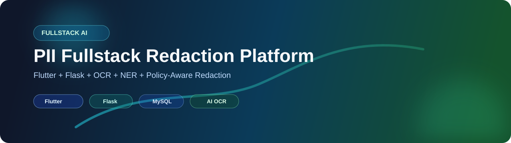

# PII Fullstack Redaction Platform



[](https://github.com/Paulson-2004/Secure_PII_Redaction_System/stargazers)
[](https://github.com/Paulson-2004/Secure_PII_Redaction_System/network/members)
[](https://github.com/Paulson-2004/Secure_PII_Redaction_System/issues)
[](https://Paulson-2004/Secure_PII_Redaction_System/commits/main)

[](https://github.com/Paulson-2004/Secure_PII_Redaction_System)
[](LICENSE)
[](https://www.python.org/)
[](https://flutter.dev/)
[](https://flask.palletsprojects.com/)
[](https://www.mysql.com/)

Production-style fullstack system for detecting and redacting Personally Identifiable Information from document images using a hybrid AI pipeline.

## Why This Project

- End-to-end workflow: authentication, upload, detection, decisioning, and redacted output.
- Multi-stage AI pipeline: OCR + regex + NER + policy-aware decisions.
- Fullstack delivery: Flutter client and Flask backend in one repository.
- Audit-focused: redaction results and processing logs are available in the app.

## Repository Structure

```text
Secure_PII_Redaction_System/
├─ PII/                     # Main application
│  ├─ lib/                  # Flutter app (UI + state + services)
│  ├─ modules/              # AI pipeline modules (OCR, regex, NER, hybrid, RAG, redaction)
│  ├─ app.py                # Flask backend entry point
│  ├─ requirements.txt      # Python dependencies
│  ├─ pubspec.yaml          # Flutter dependencies
│  ├─ RUNNING_GUIDE.md
│  └─ TESTING_GUIDE.md
├─ README.md                # This file
└─ LICENSE
```

## System Architecture

```text
Flutter Client (Web & Mobile, Material 3)
	│
	│ HTTP API (Bearer Token / X-Auth-Token)
	▼
Flask REST Backend (app.py)
	│
	├──> Database Layer (MySQL Connection Pool + SQLite Fallback privlock.db)
	│
	└──> AI Redaction Pipeline:
	     ├──> OCR Engine (Single-pass Tesseract + OpenCV + PyMuPDF)
	     ├──> Regex Detector (Precompiled + Verhoeff & Luhn Checksums)
	     ├──> NER Detector (SpaCy en_core_web_sm + Administrative Blacklist)
	     ├──> Hybrid Fusion Engine (Semantic Type Compatibility Matrix)
	     ├──> Policy Decision Engine (15 Regulations + Dense/TF-IDF Cosine Retrieval)
	     └──> Redaction Engine (Sequence-Aware Visual Masking + Descending Slicing)
```

## Quick Start

### 1. Clone

```bash
git clone https://github.com/Paulson-2004/Secure_PII_Redaction_System.git
cd Secure_PII_Redaction_System/PII
```

### 2. Backend Setup

```bash
python -m venv .venv
# Windows
.venv\Scripts\activate
pip install -r requirements.txt
python -m spacy download en_core_web_sm
```

### 3. Environment Configuration

```bash
copy .env.example .env
```

Update `.env` with your local configuration values.

### 4. Start Backend

```bash
python app.py
```

Backend health endpoint:

```text
http://127.0.0.1:5000/api/health
```

### 5. Start Flutter Web Client

```bash
flutter pub get
flutter run -d chrome --dart-define=API_BASE_URL=http://127.0.0.1:5000 --web-port=5080
```

Client URL:

```text
http://localhost:5080
```

## Core Features

- **Authentication & Tenant Isolation**: bcrypt password hashing, token validation, token revocation on logout, and user-isolated document access.
- **Resilient Database Layer**: Thread-safe MySQL connection pooling (`MySQLConnectionPool`) with an automatic, zero-config SQLite fallback (`privlock.db`) for offline development and academic evaluation.
- **Single-Pass Document OCR**: Optimized image preprocessing and line reconstruction via Tesseract with support for PDF and text files. (Achieved 49.0% latency reduction in the local benchmark using the specified test image and 5-run average).
- **High-Precision PII Detection**:
  - Pre-compiled regex patterns with mathematical **Verhoeff ($D_5$) checksum** for Aadhaar and **Luhn modulus-10 checksum** for payment cards.
  - Contextual NER via SpaCy with administrative header/label suppression dictionaries.
  - Semantic hybrid fusion with type compatibility matrix and conflict resolution.
- **Regulatory Policy Decision Engine**: Codified knowledge base of 15 statutory regulations (DPDP Act 2023, Aadhaar Act 2016 §29, IT Act 2000 §43A, PCI-DSS v4.0) with dense vector search and embedded TF-IDF cosine similarity fallback.
- **Accurate Redaction Engine**: Sequence-aware n-gram bounding box token matching preventing visual over-redaction, paired with descending start-offset text slicing.
- **Audit Logging**: Structured document processing history and system security events viewable in the Flutter UI.

## Tech Stack

- **Frontend**: Flutter (v3.x), Dart, Provider, Material 3
- **Backend**: Python (3.10+), Flask, Flask-CORS, bcrypt
- **AI & NLP**: Tesseract OCR, OpenCV, PyMuPDF, SpaCy (`en_core_web_sm`), sentence-transformers (optional), FAISS (optional), TF-IDF Cosine Retrieval (embedded fallback)
- **Data**: MySQL 8.x (primary pooled) / SQLite 3 (embedded fallback)

## Verified Quality & Benchmarks

- **Backend Automated Tests**: 34 tests passing across unit, security, and integration suites (`python -m unittest discover tests`).
- **Flutter Quality**: `flutter analyze lib` reports 0 issues; all widget tests passing.
- **Web Build**: Fully compiles to production web bundle (`flutter build web`).
- **OCR Latency Reduction**: 49.0% reduction in local controlled benchmark (1089.1 ms dual-pass vs 555.8 ms single-pass, 5-run average).

## 📸 Screenshots

Home Page


Document Upload Page


Processing & Redaction Output


Document Comparison


AI Detection Statistics


## Documentation

- App-level README: [PII/README.md](PII/README.md)
- Runtime guide: [PII/RUNNING_GUIDE.md](PII/RUNNING_GUIDE.md)
- Testing guide: [PII/TESTING_GUIDE.md](PII/TESTING_GUIDE.md)

## Security Notes

- `.env`, local uploads, generated build artifacts, and dataset folders are ignored via `.gitignore`.
- Use non-production credentials locally and rotate secrets before deployment.

## License

Licensed under MIT. See [LICENSE](LICENSE).
