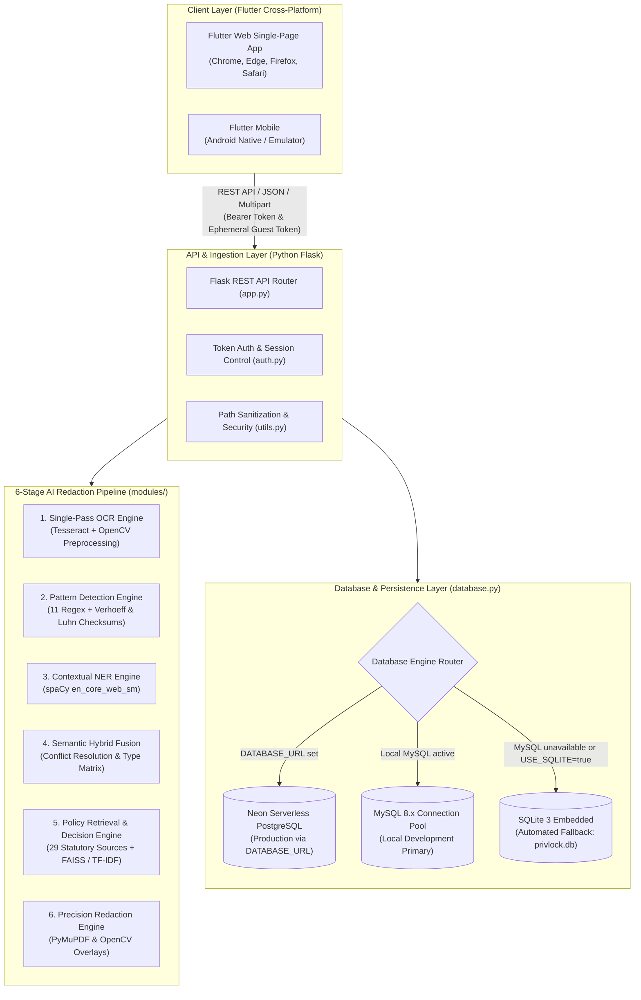
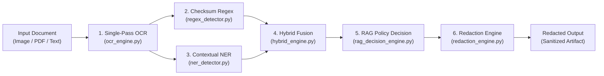
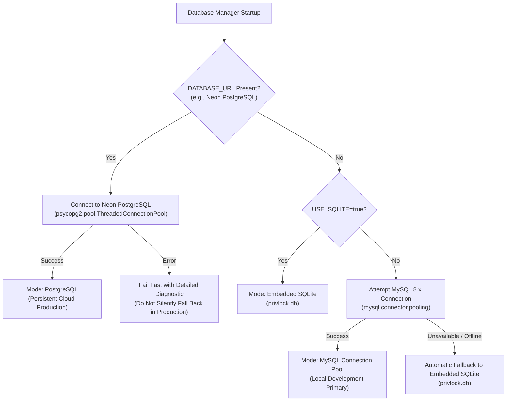
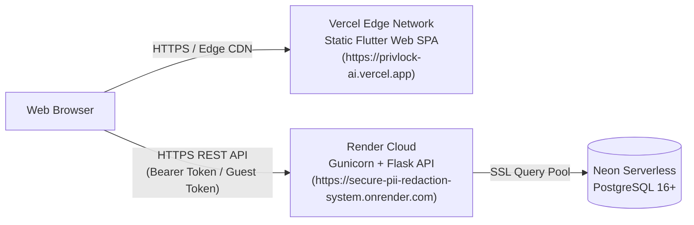

# System Architecture & AI Pipeline Specification — PrivLock

This document details the architectural topology, component boundaries, 6-stage AI redaction pipeline, and multi-engine database strategy of PrivLock.

---

## 1. High-Level System Architecture

PrivLock is architected as a decoupled client-server application adhering to defense-in-depth and clean architecture principles:

---

## 2. 6-Stage AI Redaction Pipeline

The core intelligence of PrivLock is organized into a modular pipeline in [`PII/modules/`](../PII/modules/):

### Stage 1: Single-Pass OCR Engine ([`ocr_engine.py`](../PII/modules/ocr_engine.py))
- **Adaptive OpenCV Preprocessing**: Converts input to grayscale, applies Otsu thresholding or adaptive Gaussian thresholding, and corrects skew before character recognition.
- **Single-Pass Text & Box Extraction**: Extracts both word-level and line-level bounding box coordinates (`x, y, w, h`) alongside character streams in a single Tesseract call.
- **Performance Optimization**: Benchmark testing demonstrated a **49.0% reduction in local OCR latency** (555.8 ms single-pass vs 1089.1 ms traditional dual-pass, 5-run average).
- **PDF Rendering**: Ingests multi-page PDFs via modern `pymupdf` (MuPDF vector rendering at 150 DPI) for page-by-page OCR extraction.

### Stage 2: Pattern Detection Engine ([`regex_detector.py`](../PII/modules/regex_detector.py))
Executes 11 pre-compiled regular expressions reinforced with mathematical checksum algorithms:
- **Aadhaar Number**: 12-digit Indian national identity pattern with **Verhoeff ($D_5$) dihedral group checksum validation**, eliminating OCR misread false positives.
- **Payment Card Numbers (PAN)**: 13–19 digit credit and debit card patterns with **Luhn modulus-10 checksum validation**.
- **Permanent Account Number (PAN)**: Indian income tax 10-character alphanumeric structure (`[A-Z]{5}[0-9]{4}[A-Z]{1}`) with valid fourth-character entity class assertions.
- **Indian Passport**: Sovereign travel credential format (`[A-PR-WYa-pr-wy][1-9][0-9]\\s?[0-9]{6}`).
- **Voter ID (EPIC)**: 10-character alphanumeric voter card pattern (`[A-Z]{3}[0-9]{7}`).
- **Driving Licence (DL)**: Indian state code + regional transport office format.
- **Financial Metadata**: Indian Financial System Code (IFSC), Vehicle Registration Numbers, Phone Numbers, Email Addresses, Dates of Birth (DOB).

### Stage 3: Contextual NER Engine ([`ner_detector.py`](../PII/modules/ner_detector.py))
- Utilizes the spaCy `en_core_web_sm` model to detect unstructured contextual entities: `PERSON`, `ORG`, `GPE`, `LOC`, and `DATE`.
- **Administrative Suppression Dictionary**: Filters out common institutional headers, government form labels, state names, and banking boilerplate (e.g., "GOVERNMENT OF INDIA", "INCOME TAX DEPARTMENT", "ACCOUNT NUMBER") to prevent false positives.

### Stage 4: Semantic Hybrid Fusion ([`hybrid_engine.py`](../PII/modules/hybrid_engine.py))
- Merges candidates from both regex and spaCy NER streams.
- **Span Conflict Resolution**: Detects spatial token overlaps using 1D character span intersection.
- **Type Compatibility Matrix**: Regex detections take precedence on structured identifiers (Aadhaar, PAN, Credit Card) due to mathematical checksum certainty; NER takes precedence on unstructured named entities (`PERSON`, `ORG`).
- Synchronizes character offsets with physical OCR bounding boxes for visual masking.

### Stage 5: Regulatory Policy Retrieval & Decision Engine ([`rag_decision_engine.py`](../PII/modules/rag_decision_engine.py))
- Codified knowledge base of **29 privacy & security policy sources** spanning 5 legal and technical taxonomy categories.
- **Retrieval Mechanism**: Embeds entity contexts and document types using `sentence-transformers` (`all-MiniLM-L6-v2`) with dense vector retrieval via **FAISS**.
- **Embedded Fallback**: Includes a standalone **TF-IDF cosine similarity matrix fallback** that operates with zero ML dependencies if memory is constrained.
- **Deterministic Decisioning**: Emits compliance directives: `REDACT` (solid blackout), `MASK` (format-preserving replacement), or `BLUR` (Gaussian filter), along with statutory citations, retention guidance, and legal basis notes.

### Stage 6: Precision Redaction Engine ([`redaction_engine.py`](../PII/modules/redaction_engine.py))
- **PDF Vector Redaction**: Applies native PyMuPDF redaction annotations (`page.add_redact_annot()`, `page.apply_redactions()`). Underlying font glyphs and text streams are permanently stripped from the PDF object tree, preventing copy-paste recovery.
- **Raster Image Redaction**: Overwrites target pixel regions in image matrices using OpenCV/Pillow (`#000000` blackout, format-preserving masks, or Gaussian blur with $\sigma \ge 15$).
- **Descending Start-Offset Slicing**: Plain-text redactions are processed in reverse order of character offsets, preventing text length modifications from inducing offset drift.

---

## 3. Database Layer & Resiliency Strategy

The database manager in [`PII/database.py`](../PII/database.py) implements an automatic multi-engine strategy:

### Supported Database Engines

1. **Production Engine: Neon Serverless PostgreSQL**
   - Activated automatically when `DATABASE_URL` is set in the environment.
   - Uses `psycopg2.pool.ThreadedConnectionPool` (5–20 thread-safe connections).
   - Enforces SSL encryption (`sslmode=require`).
   - Executes automatic schema migration on startup via [`PII/schema_postgres.sql`](../PII/schema_postgres.sql).
2. **Local Primary Engine: MySQL 8.x**
   - Configured via environment variables in `PII/.env` (`MYSQL_HOST`, `MYSQL_USER`, `MYSQL_PASSWORD`, `MYSQL_DB`).
   - Uses `mysql.connector.pooling.MySQLConnectionPool` for connection reuse.
   - Baseline schema defined in [`PII/schema.sql`](../PII/schema.sql).
3. **Automated Fallback Engine: Embedded SQLite 3**
   - Activated automatically if MySQL is offline or unconfigured, or when `USE_SQLITE=true` is explicitly configured in `PII/.env`.
   - Stores data in `PII/privlock.db`.
   - Enables zero-configuration local evaluation, CI testing, and offline demos.

---

## 4. Cloud Deployment Architecture

PrivLock is deployed in production combining static edge delivery with managed container execution:

- **Stateless Bearer Tokens**: Eliminates cross-origin cookie blocking between `vercel.app` and `onrender.com`.
- **Ephemeral Storage & 1-Hour TTL**: Render local disk holds documents only during processing; an automated worker unlinks all artifacts older than 3600 seconds.
- **Guest Mode Zero-Persistence**: Guest operations bypass database inserts entirely; no user or audit log records are written.

