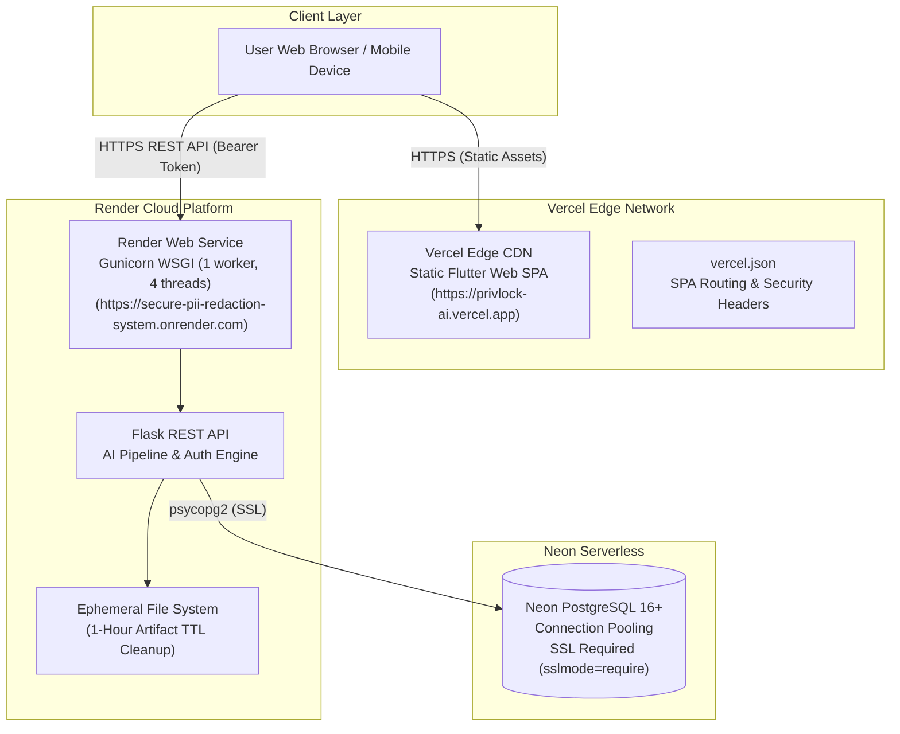

# Cloud Deployment Guide — PrivLock

This guide details the production deployment architecture, step-by-step setup, configuration parameters, and verification procedures for PrivLock across cloud infrastructure.

---

## 1. Production Architecture Overview

PrivLock is architected for zero-infrastructure-cost production deployment utilizing a decoupled cloud topology:



### Production Endpoints

| Component | Provider | Production URL | Role |
|---|---|---|---|
| **Frontend** | Vercel Edge CDN | `https://privlock-ai.vercel.app` | Static Flutter Web Single-Page Application |
| **Backend API** | Render Web Service | `https://secure-pii-redaction-system.onrender.com` | Flask REST API + AI Redaction Pipeline |
| **Database** | Neon Serverless | Configured via `DATABASE_URL` | Persistent PostgreSQL user accounts & audit logs |

---

## 2. Backend Deployment on Render

### Deployment Options

#### Option A: Render Blueprint (Automated via `render.yaml`)
The repository root contains a pre-configured [`render.yaml`](../render.yaml) specification:
1. Log in to [Render](https://render.com/).
2. Navigate to **Blueprints** $\rightarrow$ **New Blueprint Instance**.
3. Connect your GitHub repository: `Secure_PII_Redaction_System`.
4. Render parses `render.yaml` and provisions the web service automatically.

#### Option B: Manual Web Service Setup
1. On the Render Dashboard, click **New +** $\rightarrow$ **Web Service**.
2. Connect your repository.
3. Configure the following service settings:

| Parameter | Setting | Explanation |
|---|---|---|
| **Name** | `secure-pii-redaction-system` | Service subdomain identifier |
| **Region** | Oregon (US West) or closest to users | Data center location |
| **Root Directory** | `PII` | Points to the backend codebase |
| **Runtime** | `Python 3` | Render native Python runtime |
| **Build Command** | `pip install -r requirements.txt && python -m spacy download en_core_web_sm` | Installs dependencies and spaCy NER model |
| **Start Command** | `gunicorn app:app --bind 0.0.0.0:$PORT --workers 1 --threads 4 --timeout 120` | Production WSGI server with thread pooling |
| **Plan** | Free | 512 MB RAM, shared CPU |

### Environment Variables Configuration

In Render's **Environment** tab, configure the following key-value pairs:

```bash
# Production Database Connection (Neon Serverless PostgreSQL)
DATABASE_URL=postgresql://<username>:<password>@<neon-hostname>/<database>?sslmode=require
USE_POSTGRES=true

# Flask Configuration
FLASK_ENV=production
SECRET_KEY=<generate-a-secure-random-64-character-hex-string>

# CORS & Frontend Origins
CORS_ALLOWED_ORIGINS=https://privlock-ai.vercel.app,http://localhost:*
FRONTEND_URL=https://privlock-ai.vercel.app

# Optional Local Fallback (if PostgreSQL is not used)
# USE_SQLITE=true
```

> [!NOTE]
> **Render Free Tier Spin-Down**: Free Render web services spin down after 15 minutes of inactivity. When a request arrives after dormancy, Render spins up the container, which may take **30 to 50 seconds** (cold start). The Flutter frontend includes connection timeout handling and health check awareness to handle cold starts gracefully.

---

## 3. Database Setup: Neon Serverless PostgreSQL

PrivLock uses **Neon Serverless PostgreSQL** for production data persistence.

### Why PostgreSQL for Cloud Deployment
- **Persistence Across Container Restarts**: Render's free tier container filesystem is ephemeral; a local SQLite database would reset on restart. PostgreSQL ensures permanent persistence of user accounts, hashed PINs, and audit logs.
- **Serverless Autoscaling**: Neon scales compute to zero when idle and instantly provisions connections on demand.
- **Encrypted Transmission**: All connections enforce SSL encryption (`sslmode=require`).

### Automated Schema Migration
The database manager in [`PII/database.py`](../PII/database.py) detects the PostgreSQL connection and automatically runs schema migrations on startup:
1. Creates the `users` table (UUID/id, email, password hash, PIN hash, created timestamp).
2. Creates the `audit_logs` table (UUID/id, user_id foreign key, filename, pii_detected count, policy_reference, status, created timestamp).
3. Configures indexing on `user_id` and timestamps for tenant-isolated querying.

---

## 4. Frontend Deployment on Vercel

Standard Vercel build runners do not include the Flutter SDK. PrivLock utilizes Vercel as a **high-performance Edge CDN for static hosting** of the pre-compiled Flutter Web bundle.

### Option A: Local Build & Direct Vercel CLI Deploy (Recommended)

1. Navigate to the `PII` directory:
   ```bash
   cd PII
   ```
2. Build the production release web bundle, passing your production Render backend URL:
   ```bash
   flutter build web --release --dart-define=API_BASE_URL=https://secure-pii-redaction-system.onrender.com
   ```
3. Deploy the compiled static output directory directly to Vercel:
   ```bash
   npx vercel deploy build/web --prod
   ```
4. Vercel delivers the bundle with global edge caching.

### Option B: Automated GitHub Actions CI/CD Workflow

For automated deployments on `git push`, configure `.github/workflows/deploy_frontend.yml`:

```yaml
name: Deploy Flutter Web to Vercel

on:
  push:
    branches: [main]
    paths:
      - 'PII/lib/**'
      - 'PII/web/**'
      - 'PII/pubspec.yaml'

jobs:
  build-and-deploy:
    runs-on: ubuntu-latest
    steps:
      - uses: actions/checkout@v4

      - name: Set up Flutter
        uses: subosito/flutter-action@v2
        with:
          flutter-version: '3.x'
          channel: 'stable'
          cache: true

      - name: Install Dependencies
        run: |
          cd PII
          flutter pub get

      - name: Build Web Release
        run: |
          cd PII
          flutter build web --release --dart-define=API_BASE_URL=${{ secrets.PROD_API_BASE_URL }}

      - name: Deploy to Vercel
        uses: amondnet/vercel-action@v25
        with:
          vercel-token: ${{ secrets.VERCEL_TOKEN }}
          vercel-org-id: ${{ secrets.VERCEL_ORG_ID }}
          vercel-project-id: ${{ secrets.VERCEL_PROJECT_ID }}
          working-directory: PII/build/web
          vercel-args: '--prod'
```

### Vercel Routing & Security Configuration (`vercel.json`)

PrivLock includes [`vercel.json`](../vercel.json) at the root and [`PII/vercel.json`](../PII/vercel.json) to handle Single-Page Application (SPA) routing and security headers:

```json
{
  "version": 2,
  "rewrites": [
    { "source": "/(.*)", "destination": "/index.html" }
  ],
  "headers": [
    {
      "source": "/(.*)",
      "headers": [
        { "key": "X-Content-Type-Options", "value": "nosniff" },
        { "key": "X-Frame-Options", "value": "DENY" },
        { "key": "X-XSS-Protection", "value": "1; mode=block" },
        { "key": "Referrer-Policy", "value": "strict-origin-when-cross-origin" }
      ]
    }
  ]
}
```

---

## 5. Security & Network Considerations

### Cross-Origin Resource Sharing (CORS)
The backend enforces explicit CORS policies using `Flask-CORS`:
- Only requests from authorized origins (`CORS_ALLOWED_ORIGINS`) are permitted.
- Preflight `OPTIONS` requests are handled automatically with appropriate `Access-Control-Allow-Methods` and `Access-Control-Allow-Headers`.

### Stateless Token Authentication
- Uses `Authorization: Bearer <token>` and `X-Auth-Token` HTTP headers.
- **Why Not Cookies?** Cross-origin cookies between distinct subdomains (`vercel.app` and `onrender.com`) are blocked by modern browser third-party cookie restrictions (Safari ITP, Chrome Privacy Sandbox). Stateless tokens transmitted via headers eliminate cross-domain session drops.

### Ephemeral Storage & 1-Hour Artifact TTL
On Render's local disk:
- Uploaded and redacted artifacts are stored in `PII/uploads/` and `PII/uploads/redacted/`.
- A background maintenance routine cleans up files older than **1 hour (3600 seconds)**.
- Guest artifacts are tied to cryptographically generated ephemeral session tokens and cannot be accessed across sessions.

---

## 6. Alternative: Docker Container Deployment

For teams deploying to AWS ECS, Google Cloud Run, Azure Container Apps, or Kubernetes, PrivLock includes containerization assets:

### Build Docker Image
From the `PII` directory:

```bash
cd PII
docker build -t privlock-backend:latest .
```

### Run Container Locally
```bash
docker run -d \
  -p 5000:5000 \
  -e USE_SQLITE=true \
  -e SECRET_KEY=your-production-secret-key \
  --name privlock-api \
  privlock-backend:latest
```

### Multi-Container Stack (Docker Compose)
To run Flask and MySQL 8.0 together locally:

```bash
cd PII
docker compose up -d
```

---

## 7. Post-Deployment Verification

After deploying both frontend and backend, execute the following smoke tests:

1. **Verify Backend Health**:
   ```bash
   curl -i https://secure-pii-redaction-system.onrender.com/api/health
   ```
   Must return HTTP 200 with `"backend": "running"` and `"database": "connected"`.

2. **Verify Frontend Loading**:
   Visit `https://privlock-ai.vercel.app` in your browser. Confirm the landing screen displays properly with "Sign In", "Register", and "Continue as Guest" buttons.

3. **Verify End-to-End Guest Redaction**:
   Click "Continue as Guest", upload a test document, and verify redaction output renders in under 5 seconds.

