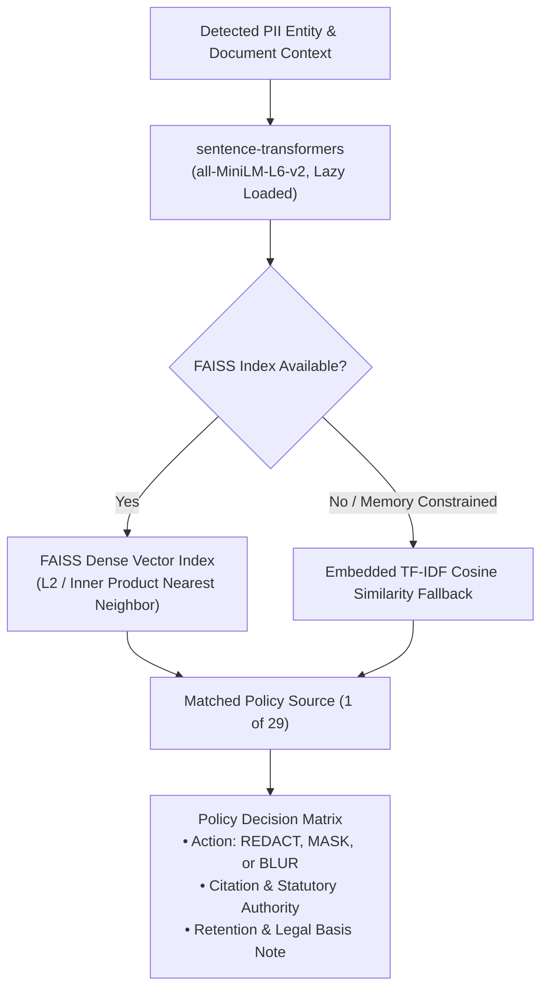

# Regulatory & Security Policy Corpus — PrivLock

This document details the codified knowledge base of 29 privacy, security, and data protection policy sources embedded within PrivLock's RAG policy retrieval and decision engine.

---

## 1. Engine Architecture & Policy Retrieval

PrivLock utilizes a dual-tier retrieval architecture implemented in [`PII/modules/rag_decision_engine.py`](../PII/modules/rag_decision_engine.py):



### Core Invariants
- **29 Verified Entries**: Exactly 29 policy entries spanning 5 distinct taxonomy categories.
- **Lazy SentenceTransformer Loading**: Heavy ML embedding models are loaded lazily on the first request to minimize initial memory usage and cold start time on constrained free-tier instances.
- **Embedded TF-IDF Fallback**: A self-contained TF-IDF vectorizer and cosine similarity matrix ensures instant, zero-dependency policy retrieval even if PyTorch or SentenceTransformers are unavailable.
- **Non-Generative**: Policy retrieval is deterministic and strictly references verified knowledge base entries. PrivLock does not generate or hallucinate legal advice.

---

## 2. Taxonomy Breakdown

The 29 policy sources are rigorously classified into five authoritative categories:

| Category | Count | Definition | Primary Authority Example |
|---|---|---|---|
| **Legislation** | 10 | Primary parliamentary acts and sovereign statutes | India DPDP Act 2023, UIDAI Aadhaar Act 2016, EU GDPR |
| **Regulation** | 6 | Subordinate rules, executive notifications, and regulatory orders | DPDP Rules 2025, IT SPDI Rules 2011, RBI KYC Master Direction |
| **Standard** | 2 | Published industry consensus security standards | PCI DSS v4.0.1, ISO/IEC 27001:2022 Control A.8.11 |
| **Official Guidance** | 1 | Government agency technical publications and recommendations | NIST SP 800-122 |
| **Policy Mapping** | 10 | Technical redaction heuristics mapped to statutory principles | Medical confidentiality, Bank statement redaction, Salary privacy |

---

## 3. Complete Corpus Catalog (29 Sources)

### Category A: Legislation (10 Sources)

1. **Digital Personal Data Protection Act, 2023 (India)**
   - *Authority*: Parliament of India / Ministry of Electronics and Information Technology (MeitY)
   - *Citation*: Act No. 22 of 2023; Sections 4, 5, 6, 8, 9
   - *Application*: Broad statutory mandate for data fiduciary obligations, reasonable security safeguards, and children's data protection.
2. **Aadhaar (Targeted Delivery of Financial and Other Subsidies, Benefits and Services) Act, 2016 (Amended 2019)**
   - *Authority*: Unique Identification Authority of India (UIDAI) / Parliament of India
   - *Citation*: Act No. 18 of 2016; Section 29
   - *Application*: Absolute restriction on publishing, displaying, or posting 12-digit Aadhaar numbers and core biometric information.
3. **Income Tax Act, 1961 (India)**
   - *Authority*: Central Board of Direct Taxes (CBDT) / Ministry of Finance
   - *Citation*: Act No. 43 of 1961; Sections 139A & 138
   - *Application*: Confidentiality of taxpayer disclosures and regulation of Permanent Account Number (PAN) quoting.
4. **Motor Vehicles Act, 1988 (Amended 2019)**
   - *Authority*: Ministry of Road Transport and Highways (MoRTH)
   - *Citation*: Act No. 59 of 1988; Sections 8–10
   - *Application*: Protection of Driving Licence credentials and regional transport authority registries.
5. **Representation of the People Act, 1951**
   - *Authority*: Election Commission of India (ECI)
   - *Citation*: Act No. 43 of 1951; Section 61
   - *Application*: Protection of voter registration details and Electoral Photo Identity Card (EPIC) credentials.
6. **Passports Act, 1967**
   - *Authority*: Ministry of External Affairs (MEA) / ICAO Doc 9303
   - *Citation*: Act No. 15 of 1967; Sections 3 & 12
   - *Application*: Sovereign travel credential confidentiality, MRZ protection, and passport number safeguarding.
7. **General Data Protection Regulation (EU) 2016/679 (GDPR)**
   - *Authority*: European Parliament and Council of the European Union
   - *Citation*: EUR-Lex Regulation (EU) 2016/679; Articles 4(1), 5(1)(c), 6, 9(1), 32–34
   - *Application*: Data minimization, lawful processing, special category (sensitive) personal data protection, and breach prevention.
8. **Information Technology Act, 2000**
   - *Authority*: Parliament of India / MeitY
   - *Citation*: Act No. 21 of 2000; Sections 43A & 72A
   - *Application*: Civil liability for failure to protect sensitive personal data and criminal penalty for disclosure in breach of lawful contract.
9. **Right to Information Act, 2005**
   - *Authority*: Parliament of India / DoPT
   - *Citation*: Act No. 22 of 2005; Section 8(1)(j)
   - *Application*: Statutory exemption from public disclosure for personal information that has no public interest and causes invasion of privacy.
10. **Census Act, 1948**
    - *Authority*: Office of the Registrar General & Census Commissioner, India
    - *Citation*: Act No. 37 of 1948; Section 15
    - *Application*: Absolute statutory confidentiality of census individual returns; immunity from discovery or evidence in court.

### Category B: Regulations & Subordinate Rules (6 Sources)

11. **Digital Personal Data Protection Rules, 2025**
    - *Authority*: Ministry of Electronics and Information Technology (MeitY)
    - *Citation*: Final subordinate rules notified November 2025; Rules 6, 7, 8
    - *Application*: Operational technical standards for security safeguards, automated data erasure routines, and breach notification mechanisms.
12. **Information Technology (Reasonable Security Practices and Procedures and Sensitive Personal Data or Information) Rules, 2011 (SPDI Rules)**
    - *Authority*: Ministry of Communications and Information Technology (G.S.R. 313(E))
    - *Citation*: Rules framed under Section 43A of IT Act 2000; Rules 3–6
    - *Application*: Definition of passwords, financial information, biometric data, and physical/mental health condition as SPDI.
13. **Registration of Electors Rules, 1960**
    - *Authority*: Election Commission of India / Ministry of Law and Justice
    - *Citation*: S.O. 2750; Rule 28
    - *Application*: Custody and format standards for Electoral Photo Identity Cards (EPIC).
14. **Central Motor Vehicles Rules, 1989 (CMVR)**
    - *Authority*: Ministry of Road Transport and Highways
    - *Citation*: CMVR Rule 16
    - *Application*: Technical specifications and data fields for smart-card and digital Driving Licences.
15. **Aadhaar (Sharing of Information) Regulations, 2016**
    - *Authority*: Unique Identification Authority of India (UIDAI)
    - *Citation*: UIDAI Notification No. 13012/64/2016/Legal/Vol.III; Regulations 3 & 4
    - *Application*: Prohibition against public display and rules governing authorized tokenization/masking of Aadhaar credentials.
16. **RBI Master Direction – Know Your Customer (KYC) Direction, 2016 (Updated 2024)**
    - *Authority*: Reserve Bank of India (RBI)
    - *Citation*: RBI/DBR/2015-16/18 Master Direction DBR.AML.BC.No.81/14.01.001/2015-16; Section 16
    - *Application*: Mandate for regulated financial entities to redact or mask the first 8 digits of Aadhaar numbers upon document receipt.

### Category C: Standards (2 Sources)

17. **PCI DSS v4.0.1 (Payment Card Industry Data Security Standard)**
    - *Authority*: PCI Security Standards Council (PCI SSC)
    - *Citation*: Standard published June 2024; Requirements 3.4 & 3.5
    - *Application*: Mandate to render Primary Account Numbers (PAN) unreadable anywhere they are stored (masking, truncation, hashing) and strictly prohibit retention of Sensitive Authentication Data (SAD / CVV).
18. **ISO/IEC 27001:2022 Control A.8.11 (Data Masking)**
    - *Authority*: International Organization for Standardization (ISO) / International Electrotechnical Commission (IEC)
    - *Citation*: ISO/IEC 27001:2022 Annex A, Control A.8.11
    - *Application*: Organizational control requirement that data masking should be applied in accordance with the organization's access control policy and applicable legislation.

### Category D: Official Technical Guidance (1 Source)

19. **NIST SP 800-122 (Guide to Protecting the Confidentiality of PII)**
    - *Authority*: National Institute of Standards and Technology (US Department of Commerce)
    - *Citation*: NIST Special Publication 800-122 (2010)
    - *Application*: De-identification techniques, impact levels of confidentiality loss, and procedural safeguards for protecting direct and indirect PII.

### Category E: Policy Mappings (10 Sources)

*Policy mappings define technical redaction heuristics derived from statutory obligations, common law confidentiality doctrines, or sectorial best practices where no standalone redaction act exists:*

20. **Medical & Health Record Protection**
    - *Derivation*: Derived from DPDP Act 2023 Section 8(5), DPDP Rules 2025 Rule 6, and EU GDPR Article 9.
    - *Historical Note*: DISHA (Digital Information Security in Healthcare Act) was a **2018 draft bill and was never enacted** into law. Medical data protection in PrivLock is strictly mapped as a technical policy derived from current enacted statutory authorities.
21. **Bank Statement & Account Redaction**
    - *Derivation*: Derived from RBI KYC Master Direction 2016/2024, Banking Regulation Act 1949, and DPDP Act 2023 Section 8(5).
22. **Salary Slip & Compensation Confidentiality**
    - *Derivation*: Derived from DPDP Act 2023, Code on Wages 2019, and common-law employer-employee confidentiality duties.
23. **Tax Return & ITR Confidentiality**
    - *Derivation*: Derived from Income Tax Act 1961 Section 138 and DPDP Act 2023.
24. **Commercial Contract & NDA Confidentiality**
    - *Derivation*: Derived from Indian Contract Act 1872 and commercial trade secret doctrines.
25. **General PII Technical Redaction Baseline**
    - *Derivation*: Conservative privacy baseline synthesized from DPDP Act 2023 Sec 8(5), GDPR Art 5, and ISO 27001 Control A.8.11.
26. **Postal Index Demographic Mapping**
    - *Derivation*: Synthesized from Department of Posts PIN code system (1972) for geographic anonymization.
27. **Public Corporate Entity Governance**
    - *Derivation*: Derived from Companies Act 2013 Section 399 public registry rules (corporate identification numbers and public domain disclosures).
28. **Bank Routing Metadata Mapping**
    - *Derivation*: Derived from RBI public IFSC/MICR clearing registry for payment routing metadata.
29. **Student & Academic Record Confidentiality**
    - *Derivation*: Derived from DPDP Act 2023 Section 9 (enhanced obligations for children's data) and academic institutional confidentiality norms.

---

## 4. Statutory Mandates vs. Technical Redaction Actions

A fundamental engineering principle of PrivLock is the distinction between legal obligations and automated redaction operations:

```text
[ Sovereign Statute / Regulation ]
       │ Defines legal duty (e.g. "Data minimization", "Aadhaar number suppression")
       ▼
[ PrivLock Policy Decision Matrix ]
       │ Evaluates entity risk, context, and document type
       ▼
[ Technical Redaction Action ]
       ├──> REDACT : Permanent irreversible visual blackout (#000000)
       ├──> MASK   : Format-preserving character replacement (****)
       └──> BLUR   : Multi-pass Gaussian smoothing filter (sigma >= 15)
```

PrivLock translates legal requirements into deterministic technical transforms:
- **Aadhaar Act 2016 Sec 29 & RBI KYC**: First 8 digits masked (`XXXX-XXXX-1234`) or full number blacked out.
- **PCI DSS v4.0.1 Req 3.4/3.5**: Middle digits of PAN masked; CVV/CVC irreversibly obliterated.
- **Income Tax Act Sec 139A**: 10-character alphanumeric PAN masked or blacked out.

---

## 5. Compliance Disclaimer

> [!IMPORTANT]
> **Legal Disclaimer**: The policy citations and classifications provided by PrivLock are for technical guidance, privacy auditability, and automated masking assistance only. PrivLock is not a law firm, does not provide legal advice, and does not certify that any processed document complies with applicable data protection laws. Organizations must consult qualified legal counsel to determine their specific regulatory obligations.

