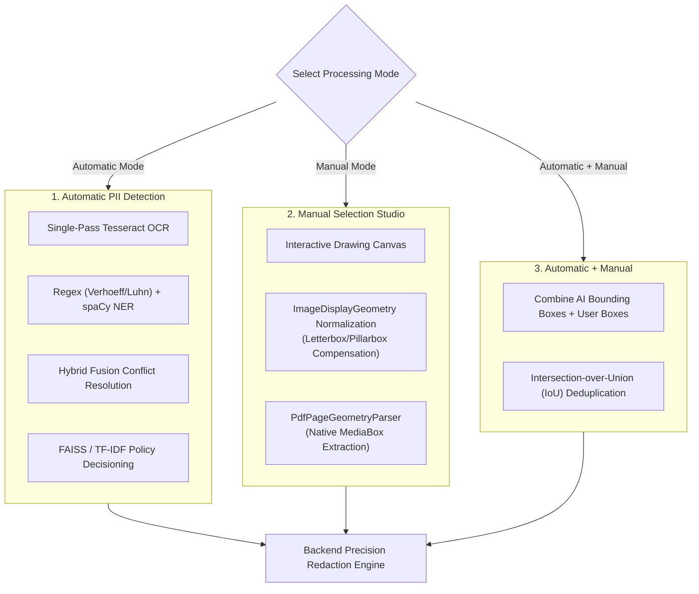
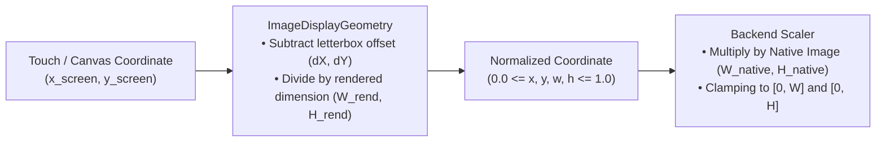

# Redaction Engine & Geometry Guide — PrivLock

This document details the AI and manual redaction capabilities of PrivLock, focusing on processing modes, visual treatments, coordinate transformation mathematics, native PDF MediaBox geometry detection, and multi-page document preservation.

---

## 1. Processing Modes

PrivLock provides three distinct redaction modes to balance automated intelligence with manual control:

### Mode Comparison

| Mode | Input Requirements | What Is Redacted | Unmarked Content |
|---|---|---|---|
| **Automatic PII Detection** | None (1-click) | All PII identified by OCR, Regex, NER, and Policy Engine | Preserved intact |
| **Manual Selection** | User draws rectangles on canvas | **Only** user-specified rectangular zones | **100% strictly untouched** |
| **Automatic + Manual** | User draws optional custom zones | Union of AI-detected PII + user zones (IoU deduplicated) | Preserved intact |

---

## 2. Visual Treatments

PrivLock supports three visual treatments applicable to both automated and manual redactions:

| Visual Action | Visual Appearance | Technical Implementation | Best For |
|---|---|---|---|
| **Redact (Blackout)** | Solid opaque black rectangle (`#000000`) | Direct bitmap pixel overwrite (images) or PyMuPDF redaction annotation stripping underlying text (PDFs) | High-risk government identifiers (Aadhaar, PAN, SSN), signatures, photos |
| **Mask** | Format-preserving mask (e.g. `XXXX-XXXX-1234` or `****`) | Text replacement preserving surrounding context and token length | Credit card numbers, account numbers, partial telephone numbers |
| **Blur** | Gaussian smoothing filter | Multi-pass OpenCV Gaussian filter with broad kernel ($\sigma \ge 15$) destroying high-frequency edge data | Facial photos, secondary background details, sensitive logos |

---

## 3. Coordinate System Mathematics (`ImageDisplayGeometry`)

When displaying images on web and mobile viewports using Flutter's `BoxFit.contain`, the viewport often introduces **letterboxing** (horizontal bars) or **pillarboxing** (vertical bars) to preserve the original aspect ratio without distortion.

A naive mapping of screen touch coordinates directly to image coordinates causes severe horizontal or vertical shifting. PrivLock solves this mathematically via [`ImageDisplayGeometry`](../PII/lib/models/image_display_geometry.dart):

### Mathematical Formulation

Given:
- Viewport size: $(W_{view}, H_{view})$
- Intrinsic image/page size: $(W_{intrinsic}, H_{intrinsic})$
- Image aspect ratio: $R_{img} = \frac{W_{intrinsic}}{H_{intrinsic}}$
- Viewport aspect ratio: $R_{view} = \frac{W_{view}}{H_{view}}$

#### Step 1: Rendered Dimensions Calculation
$$\text{If } R_{img} > R_{view} \text{ (Pillarboxed / Width Constrained)}:$$
$$W_{rendered} = W_{view}, \quad H_{rendered} = \frac{W_{view}}{R_{img}}$$

$$\text{If } R_{img} \le R_{view} \text{ (Letterboxed / Height Constrained)}:$$
$$H_{rendered} = H_{view}, \quad W_{rendered} = H_{view} \times R_{img}$$

#### Step 2: Display Origin Offsets
$$dX = \frac{W_{view} - W_{rendered}}{2}, \quad dY = \frac{H_{view} - H_{rendered}}{2}$$

#### Step 3: Screen to Normalized Mapping
For any coordinate $(x_{screen}, y_{screen})$ drawn on the canvas:
$$x_{norm} = \text{clamp}\left(\frac{x_{screen} - dX}{W_{rendered}}, 0.0, 1.0\right)$$
$$y_{norm} = \text{clamp}\left(\frac{y_{screen} - dY}{H_{rendered}}, 0.0, 1.0\right)$$

#### Step 4: Backend Absolute Reconstruction
On the backend (where native raster dimensions are $W_{native}, H_{native}$):
$$X_1 = \text{round}(x_{norm} \times W_{native}), \quad Y_1 = \text{round}(y_{norm} \times H_{native})$$
$$X_2 = \text{round}((x_{norm} + w_{norm}) \times W_{native}), \quad Y_2 = \text{round}((y_{norm} + h_{norm}) \times H_{native})$$

This formulation guarantees **pixel-perfect coordinate alignment** regardless of client screen resolution, browser window scaling, or device pixel ratio (DPR).

---

## 4. Native PDF Page Geometry (`PdfPageGeometryParser`)

PDFs are vector-based document containers with arbitrary, page-specific dimensions and rotation angles (e.g. A4 portrait, A4 landscape, US Letter, Legal, or custom blueprint dimensions).

### Native MediaBox Inspection
PrivLock implements [`PdfPageGeometryParser`](../PII/lib/models/pdf_page_geometry.dart) in Dart to extract the native page geometry directly from raw PDF bytes before rendering:

1. **MediaBox Parsing**: Extracts `/MediaBox [x0 y0 x1 y1]` bounding vectors for each individual page.
2. **Page Rotation Compensation**: Detects `/Rotate` attributes ($90^\circ, 180^\circ, 270^\circ$) and transposes width and height accordingly.
3. **Detected Geometry Display**: The UI displays the detected geometry directly to the user (e.g., `Page 1 · A4 Portrait (595 × 842)` or `Page 2 · A4 Landscape (842 × 595)`).
4. **Authoritative Geometry Policy**: The detected native geometry is authoritative. Manual aspect ratio presets cannot silently corrupt coordinate mapping.

---

## 5. Multi-Page Document Redaction & Selective Preservation

PrivLock handles complex multi-page PDF workflows with granular page selectivity:

- **Per-Page Manual Zones**: Each manual region specifies a `page` index (1-indexed).
- **Zero-Touch Preservation**: In **Manual Selection** mode, any page that contains no user-defined selection rectangles is **completely preserved untouched** in the final exported PDF. Vector paths, text streams, and embedded images on unmarked pages are copied directly without re-rasterization.
- **Combined Mode Deduplication**: In **Automatic + Manual** mode, the backend computes Intersection-over-Union (IoU) between automated AI bounding boxes and user-drawn boxes to eliminate duplicate redaction passes on overlapping zones.
- **Security Cap**: The backend enforces a strict ceiling of **50 manual regions per document** to prevent denial-of-service (DoS) memory exhaustion attacks.

---

## 6. Text Redaction & Descending Offset Slicing

For plain text documents (`.txt`), string length changes caused by masking can cause subsequent character positions to shift (offset drift).

PrivLock eliminates offset drift using **descending start-offset slicing**:
1. All detected PII entities are sorted in **descending order of their start character offset** ($offset_{start}$ from highest to lowest).
2. Slicing and string replacement are executed from the end of the document toward the beginning.
3. Because substitutions only modify text after the current offset, preceding character positions remain perfectly stable throughout the entire redaction pass.

