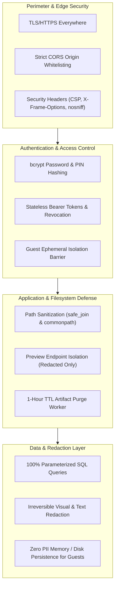
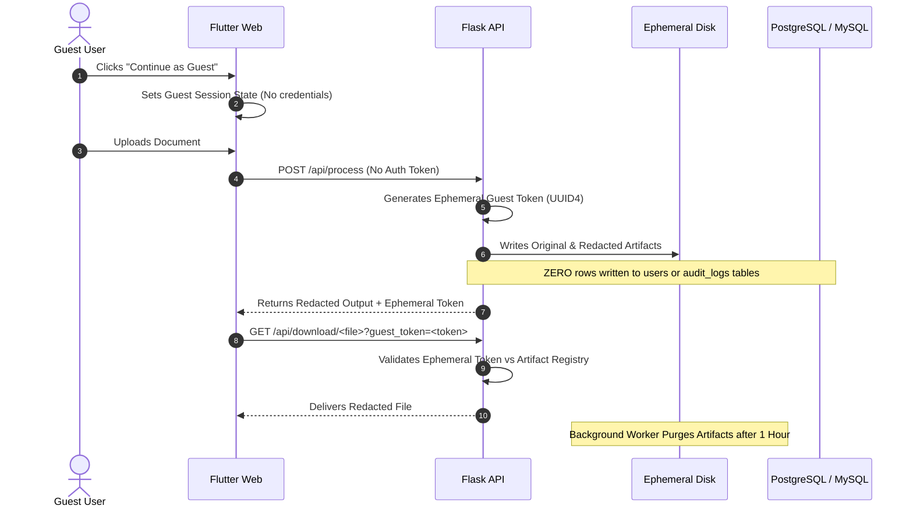

# Security & Privacy Architecture — PrivLock

This document details the multi-layered security controls, authentication mechanisms, path sanitization, data isolation barriers, and compliance safeguards implemented across PrivLock.

---

## 1. Security Architecture Principles

PrivLock is built around defensive security and privacy-by-design principles:



---

## 2. Authentication & Credential Protection

### Password and PIN Hashing
- **Algorithm**: `bcrypt` with adaptive salt generation (`bcrypt.gensalt(12)`).
- **Secondary PIN**: Users configure an optional 4 to 6 digit security PIN for re-authenticating sensitive actions. The PIN is hashed with bcrypt before database storage.
- **Zero Plaintext Exposure**: Passwords and PINs are never stored in plaintext, logged, or included in API error responses.

### Stateless Session Management
- **Token Passing**: Sessions use cryptographically random Bearer tokens transmitted via standard HTTP headers:
  - `Authorization: Bearer <token>`
  - `X-Auth-Token: <token>`
- **Token Invalidation on Logout**: The `/logout` endpoint explicitly invalidates active tokens from the session registry.
- **Header vs Cookie Architecture**: Using headers eliminates cross-subdomain cookie blocking between distinct platforms (e.g. `vercel.app` frontend and `onrender.com` backend), mitigating CSRF vulnerabilities while maintaining strong session isolation.

---

## 3. Guest Mode Security & Zero-Persistence Guarantee

PrivLock supports friction-free evaluation through **Guest Mode**, engineered with strict privacy barriers:



### Guest Mode Security Guarantees
1. **Zero Database Persistence**:
   - No rows are created in the `users` table.
   - No rows are written to the `audit_logs` or history tables.
   - Processing metrics are returned strictly in the HTTP response and discarded upon session close.
2. **Ephemeral Guest Tokens**:
   - Each guest document transaction issues a high-entropy UUID4 token.
   - Downloads and previews require the matching ephemeral token.
   - Guest tokens expire after document retrieval or upon the 1-hour TTL boundary.
3. **Artifact Auto-Purge (1-Hour TTL)**:
   - A background cleanup routine scans `PII/uploads/` and `PII/uploads/redacted/` every hour.
   - All files with modified times older than 3600 seconds are permanently unlinked from disk.
4. **Audit Log Access Gating**:
   - The `/audit-logs` endpoint strictly requires full user authentication.
   - Guest requests attempting to access audit trails receive HTTP 401 Unauthorized with a user-facing prompt to create an account.

---

## 4. Input Sanitization & Path Traversal Prevention

PrivLock processes untrusted file uploads and arbitrary filenames from external clients. To defend against directory traversal attacks (`../`, `%2e%2e%2f`):

### Strict Filename Normalization
```python
# utils.py / app.py
from werkzeug.utils import secure_filename

filename = secure_filename(uploaded_file.filename)
```
- Strips special control characters, path separators (`/`, `\`), and dangerous shell characters.
- Generates unique timestamped prefixes (`UUID_filename.ext`) to avoid filename collisions and overwrites.

### Path Anchoring with `safe_join`
All file resolution operations utilize strict directory anchoring:
```python
def safe_join(base_dir, path):
    resolved_path = os.path.abspath(os.path.join(base_dir, path))
    base_path = os.path.abspath(base_dir)
    if os.path.commonpath([base_path, resolved_path]) != base_path:
        raise PermissionError("Directory traversal detected.")
    return resolved_path
```
- Guarantees that resolved filesystem paths remain strictly within the authorized target directory.
- Rejects any attempts to escape through symbolic links or relative parent traversal.

### Preview Endpoint Isolation
The `/api/preview/<filename>` endpoint enforces a crucial privacy guarantee:
- **Exclusively Serves Redacted Files**: Path resolution is locked to `PII/uploads/redacted/`.
- **Rejection of Raw Uploads**: If a client requests a file originating from `PII/uploads/` (the unredacted source directory), the endpoint immediately aborts with HTTP 403 Forbidden.
- **Guarantee**: Raw, unredacted PII is never exposed over the network via preview endpoints.

---

## 5. SQL Injection Defenses & Database Security

PrivLock interacts with relational databases (MySQL, PostgreSQL, and SQLite) exclusively through safe interfaces:

- **100% Parameterized Queries**: All `SELECT`, `INSERT`, `UPDATE`, and `DELETE` queries use parameter binding (`%s` in MySQL/PostgreSQL, `?` in SQLite):
  ```python
  # Safe parameterized query
  cursor.execute(
      "SELECT id, password_hash FROM users WHERE email = %s",
      (email,)
  )
  ```
- **Zero String Concatenation**: User inputs are never concatenated directly into SQL query strings.
- **Tenant Isolation**: All audit log and history queries enforce `WHERE user_id = %s`, ensuring users cannot inspect or enumerate other users' processing histories.
- **Transport Encryption**: PostgreSQL connections enforce SSL encryption (`sslmode=require`) to protect in-transit queries between the backend and serverless databases.

---

## 6. Redaction Irreversibility

A critical failure mode of naive redaction tools is superficial masking (e.g., placing a black rectangle as a separate transparent layer that can be deleted in a PDF editor, or leaving underlying text selectable). PrivLock prevents this:

### Image Documents (Raster Redaction)
- Bounding box pixel regions are modified directly in the image bitmap using OpenCV/Pillow:
  - **Blackout**: Overwrites pixel matrices with `#000000` (zero value).
  - **Mask**: Draws opaque white/black bounding blocks with overlaid asterisks (`****`).
  - **Blur**: Applies multi-pass Gaussian blur filters with wide kernels ($\sigma \ge 15$), destroying high-frequency edge information.
- The original pixel data within the bounding box is permanently overwritten and cannot be recovered from the exported image.

### PDF Documents (PyMuPDF Redaction)
- Text spans are identified with character-level bounding boxes.
- PyMuPDF redaction annotations (`page.add_redact_annot()`) are applied and committed using `page.apply_redactions()`.
- Underlying text streams, font glyphs, and searchable character maps are stripped from the PDF object tree.
- Text within redacted regions cannot be selected, copied, or extracted via PDF inspection tools.

---

## 7. Compliance Disclaimer

> [!IMPORTANT]
> **Legal Notice & Compliance Disclaimer**: PrivLock provides technical privacy/security guidance, pattern detection, and automated redaction tools. It does not provide legal advice, statutory interpretation, or certification of compliance under the Digital Personal Data Protection Act (DPDP), General Data Protection Regulation (GDPR), Payment Card Industry Data Security Standard (PCI DSS), ISO/IEC 27001, or any other privacy regulation. Machine learning and OCR models may not achieve 100% precision; manual human review is strongly recommended for high-risk, legally sensitive, or safety-critical documents.

